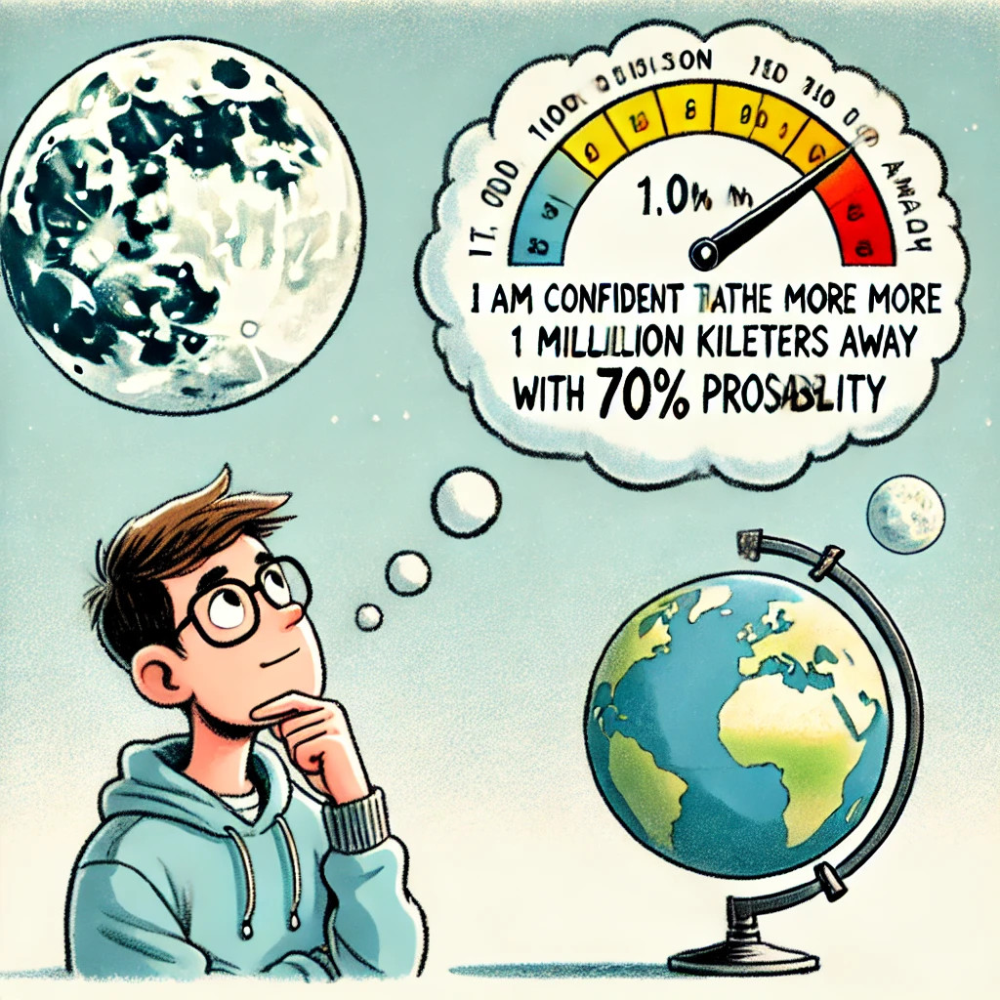
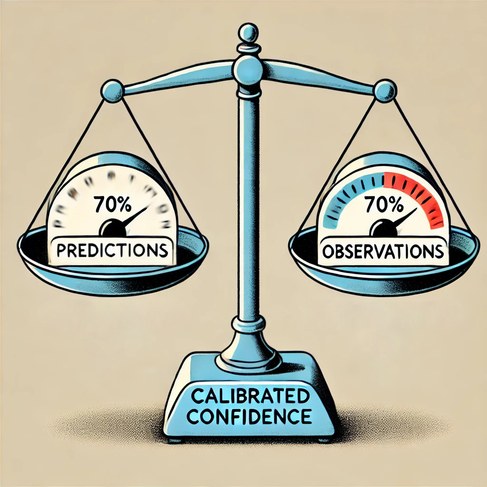
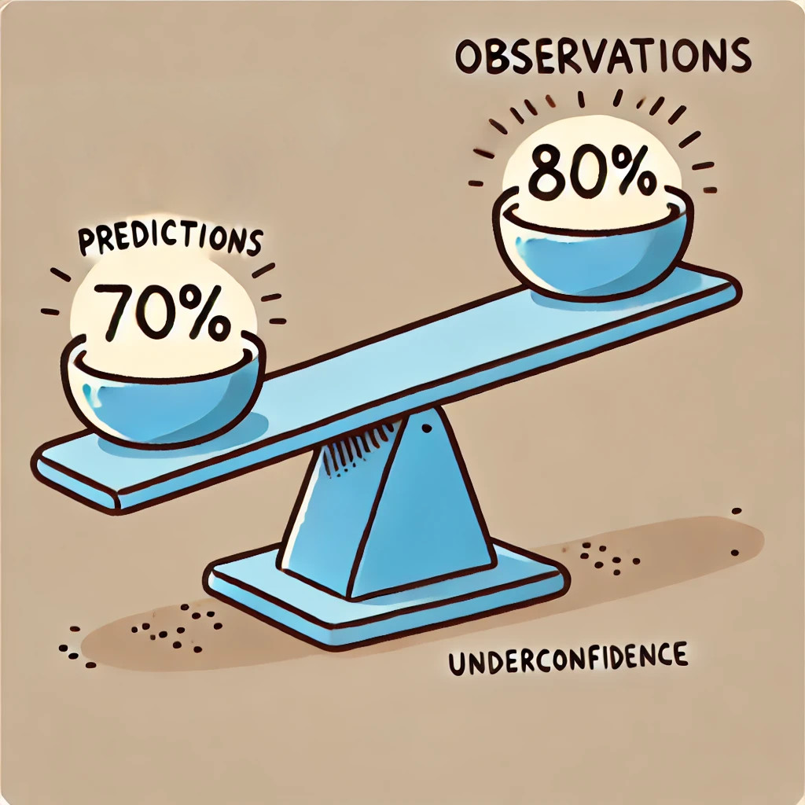

# Confidence Calibration Demo

This is a demonstration for the UniTartuCS Institute's day.  
Available at this URL: [https://novinsh.github.io/confidence-calibration-demo/](https://novinsh.github.io/confidence-calibration-demo/)

It is a conversation starter with bachelor and master students who are interested in learning more about our research at the [Machine Learning Research Group](https://ml.cs.ut.ee/) on the topics of Uncertainty Quantification and Probabilistic Calibration in Classification and Regression tasks.

The Demo is meant to be run on a portrait monitor with the possibility of taking the quizzes on the participants' phones, too. We prepared the quizzes based on the [bayes-up.web.app platform](https://github.com/Stokastix/bayes-up). Students get acquanted with the topic of calibration by answering multiple-choice questions on different topics. The minimum time required to take a quiz is 2 minutes, with the smallest quiz (Simple Demo). After taking a quiz, they can see their results under "My Stats" on this platform, where the calibration curves are depicted based on their answers.

At this stage, our research group staff are prepared to answer their questions on interpreting their result.

  
